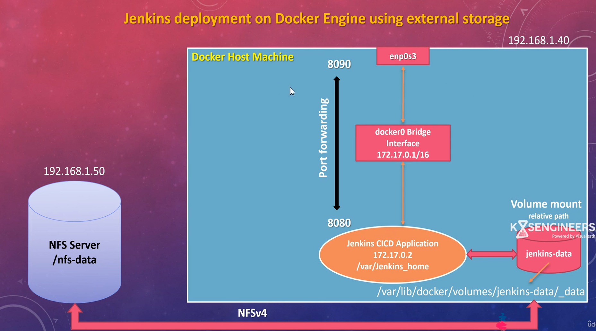

## Run jenkins as kubernetes object with volume mounts as in code or run as PV and PVC 

# Jenkins deployment on Docker Engine using external Storage - NFS Server

 

## Details: Jenkins server setup with external storage as nfs server to persist data on ubuntu machine

    Step 1 : Convert virtual machine into NFS server
    - apt install -y nfs-kernal-server

    Step 2 : Create shared folder on nfs server to be used by other servers
    -   mkdir /nfs-data
    -   chown -R nobody:nogroup /nfs-data (Everybody can write data into this folder) 

    Step 3 : Expose the folder to network for client usage
    - vi /etc/exports
    - add entries for (Client IP Address)
        /nfs-data   192.168.1.40(rw,sync,no_subtree_check,no_root_squash)
        save file and run exportfs -av
        systemctl restart nfs-kernal-server
        systemctl status nfs-kernal-server

    Step 4: Install package on clinet machine
        sudo apt install nfs-common
  
